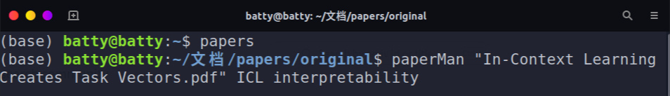

# paperMan 

本地自用paper管理小工具, 配合终端别名一起使用

个人需求很简单：
1. 阅读器需要有来回定位跳转功能 
2. paper归档需要支持多tag

但以前用着zotero, readpaper都不同时满足自己需求, 就福昕阅读器+小工具凑合用了~~(其实就是个创建软链接)~~

所有paper存放在一个original文件夹下，然后软链接到同级tag目录

以Linux为例:
```shell
# 将paperMan二进制文件移动到系统可执行程序目录下
sudo mv paperMan /usr/local/bin/

# bashrc设置一个别名
echo "alias papers='cd ~/papers/original'" >> ~/.bashrc
source ~/.bashrc
```

